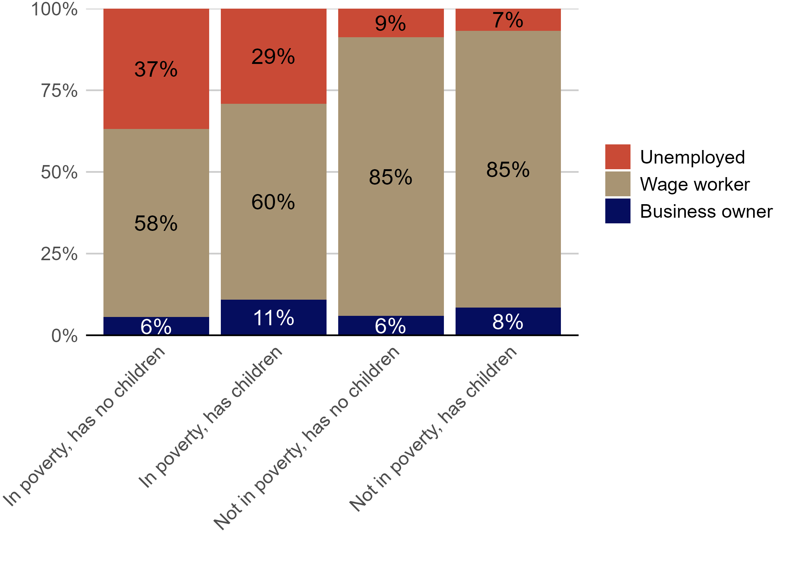
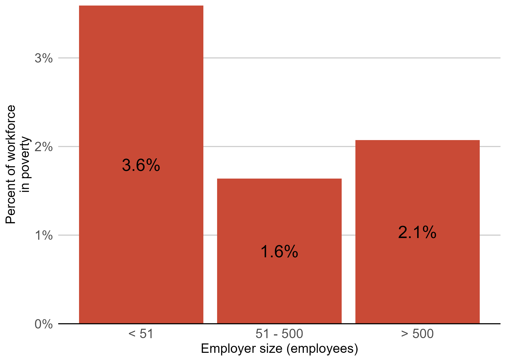
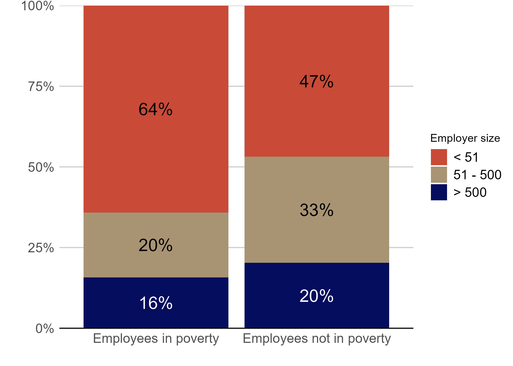
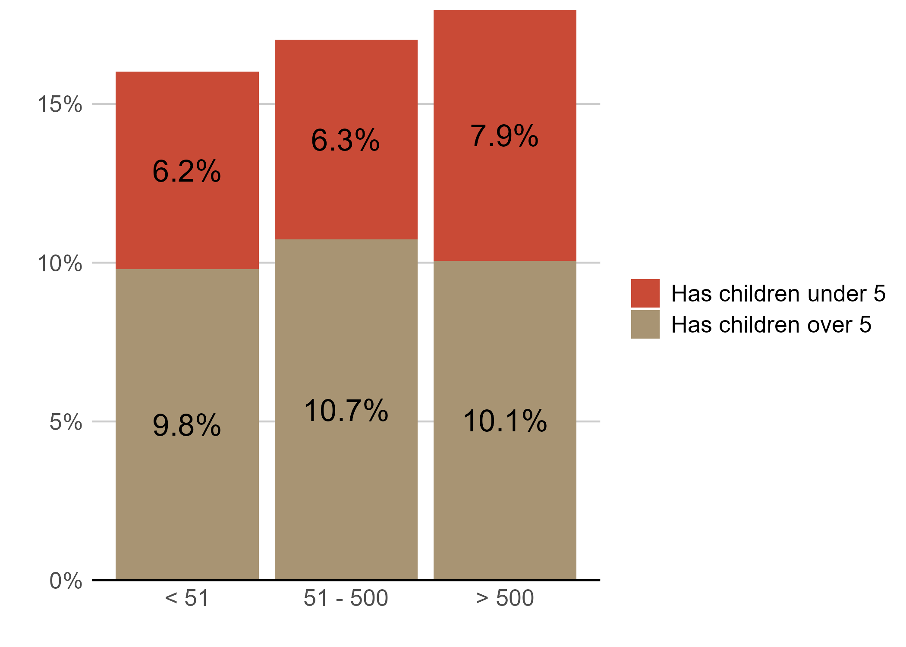
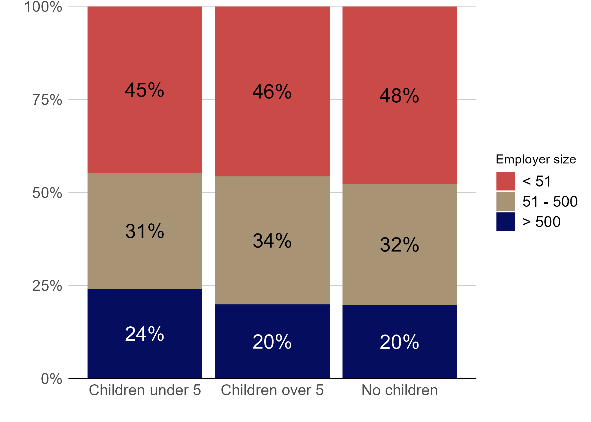

### Question 1: How does employment differ in Maryland between parents, adults without children, those in poverty, and those out of poverty?

**Figure 1:** Percent of Marylanders (aged 18 to 64\) in each type of employment by their parental and poverty statuses (2023 ACS Public Use Microdata)  

**Findings:**

* The vast majority (71%) of Maryland parents in poverty are employed. 60% of Maryland parents in poverty are employed as wage workers, and 11% run their own businesses.  
* Running a business is associated with having children. The rate of business ownership is higher across both in- and out-of-poverty cohorts for those with children.   
  * For Maryland parents not in poverty, the rate of business ownership is greater by 2 percentage points.   
  * For Maryland parents in poverty, the rate of business ownership is almost double (5.6% to 11.0%). While statistically significant, the causal mechanism is likely in both directions: parents are more likely to choose entrepreneurship for the flexibility and successful business owners have the savings and income to afford children; **we should explore this further through interviews**.  
* Surprisingly: While working-age Maryland adults without children own businesses at equal rates regardless of poverty status, Maryland parents in poverty are slightly more likely to be self-employed (11%) than Maryland parents not in poverty (8%). This difference is not highly statistically significant (p-value of 0.11), but it is **worth exploring further through community engagement**.

### Question 2:  Do small businesses hire people in poverty at a higher rate than large businesses?

**Figure 2:** Percentage of US employees in poverty by business size (2023 SIPP)  

**Figure 3:** Percent of US wage workers at each employer size, by poverty status (2023 SIPP)  

**Findings:**

* **Yes, small businesses employ more people in poverty than larger businesses.** Firms with 50 or fewer employees employ the most people in poverty (3.6%), as compared to those with 51 to 500 employees (1.6%) or those with more than 500 employees (2.1%).  
* Wage workers in poverty in the US are overwhelmingly employed (64%) by firms with 50 or fewer employees, as compared to only 47% of wage workers not in poverty.   
* **Implications**: small businesses are a large and vital part of the career pathway for people in poverty.

### Question 3: Do small businesses hire more parents?

**Figure 4:** Percentage of US employees with children by business size (2023 SIPP)  
 
**Figure 5:** Percent of US wage workers employed at each employer size, by parental status (2023 SIPP)  
  
**Findings:**

* **No, small businesses do not hire more parents, but they do make up 76-80% of employment for wage-earning parents.** Most of the differences in figures 4 and 5 are not statistically significant, but it is significant that parents of children under 5 are more often employed at firms with more than 500 employees.  
* **A potential cause that we could test in interviews**: parents seek employment at larger firms for more flexibility and better benefits (leave/healthcare)
